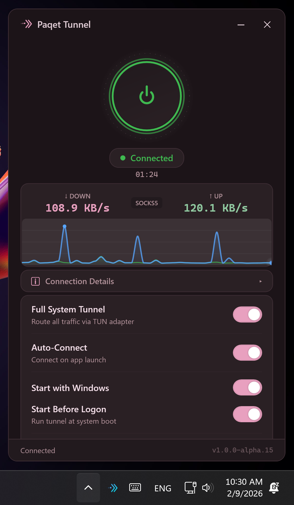
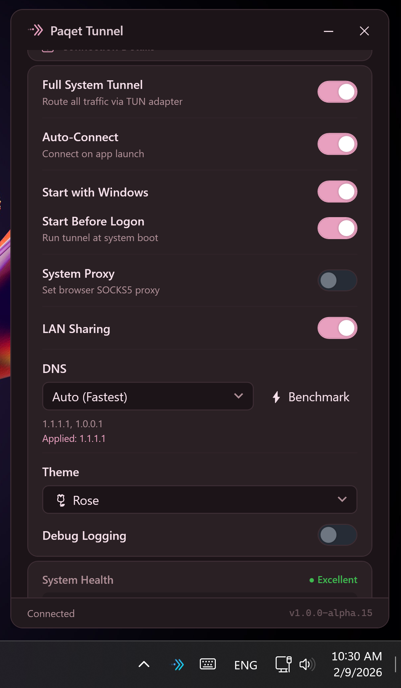

<div align="center">

<picture>
  <source media="(prefers-color-scheme: dark)" srcset="assets/logo.svg" />
  <source media="(prefers-color-scheme: light)" srcset="assets/logo.svg" />
  
</picture>

# Paqet Tunnel

**Encrypted KCP tunnel with a modern Windows GUI**

*One-click setup · Full system tunnel · Smart DNS · 10 themes · LAN sharing*

[](LICENSE)
[](https://dotnet.microsoft.com/)
[](#)

&nbsp;&nbsp;

</div>

---

## ⚡ Install

### 1. Server (Linux VPS)

```bash
curl -fsSL https://raw.githubusercontent.com/mewoZa/PaqetTunnel/master/setup.sh -o /tmp/pt.sh && sudo bash /tmp/pt.sh
```

### 2. Client (Windows — PowerShell as Admin)

```powershell
irm https://raw.githubusercontent.com/mewoZa/PaqetTunnel/master/setup.ps1 -o $env:TEMP\pt.ps1; & $env:TEMP\pt.ps1
```

### Auto Setup

After server install, it prints the exact Windows command with your IP and key — just copy and paste:

```powershell
irm https://raw.githubusercontent.com/mewoZa/PaqetTunnel/master/setup.ps1 -o $env:TEMP\pt.ps1; & $env:TEMP\pt.ps1 install -Addr YOUR_SERVER:8443 -Key "YOUR_KEY" -y
```

> **Both scripts show an interactive menu** — install, update, uninstall, status, all from one command.

---

## ✨ Features

| Feature | Description |
|---------|-------------|
| 🔒 **Full System Tunnel** | Routes all traffic through a TUN virtual adapter via WinTun + tun2socks |
| 🌐 **SOCKS5 Proxy** | Lightweight browser-only mode on `127.0.0.1:10800` |
| ⚡ **KCP Protocol** | UDP-based encrypted transport — faster than TCP in lossy networks |
| 🎯 **Smart DNS** | 18 DNS providers with auto-benchmark to find the fastest |
| 🛡️ **DNS Leak Prevention** | Forces DNS on all network adapters to prevent leaks |
| 📡 **LAN Sharing** | Share the tunnel with other devices on your network via port `10801` |
| 🎨 **10 Themes** | Dark, Light, Nord, Sakura, Ocean, Sunset, Cyberpunk, Dracula, Monokai, Rose |
| 🔄 **Auto-Connect** | Reconnect on start, auto-recover from drops (up to 5 retries) |
| 🚀 **Start with Windows** | Launch at logon, or at boot (before logon) as SYSTEM service |
| 📊 **Live Monitoring** | Real-time upload/download speed, health checks, process stats |
| 🖥️ **System Tray** | Minimal footprint — runs silently in the taskbar |
| 🩺 **CLI Diagnostics** | Built-in `--diag`, `--dns`, `--ping`, `--speed`, `--info` tools |

---

## 🏗️ Architecture

Paqet Tunnel has two modes: **SOCKS5 Proxy** (browser/app-level) and **Full System Tunnel** (all traffic).

```
                             SOCKS5 MODE
                    ┌──────────────────────────┐
                    │  Browser / App           │
                    │   ↓ proxy.pac            │
                    │  SOCKS5 127.0.0.1:10800  │
                    └────────────┬─────────────┘
                                 │
                    FULL SYSTEM TUNNEL MODE
        ┌────────────────────────┼────────────────────────┐
        │  All System Traffic    │                        │
        │   ↓                    │                        │
        │  ┌──────────────┐      │                        │
        │  │   WinTun     │      │                        │
        │  │  10.0.85.2   │      │                        │
        │  └──────┬───────┘      │                        │
        │         ↓              │                        │
        │  ┌──────────────┐      │                        │
        │  │  tun2socks   │──────┘                        │
        │  │  TUN→SOCKS5  │                               │
        │  └──────────────┘                               │
        └─────────────────────────────────────────────────┘
                                 │
┌────────────────────────────────┼──────────────────────────────┐
│  Windows Client                │                              │
│                    ┌───────────┴──────────┐                   │
│                    │   paqet (client)     │                   │
│                    │   SOCKS5 :10800      │                   │
│                    │   KCP encrypted      │                   │
│                    └───────────┬──────────┘                   │
│                                │ raw pcap (gopacket)          │
│                                │ bypasses OS routing          │
│   ┌────────────┐               │                              │
│   │ PaqetTunnel│ manages ──────┤                              │
│   │  WPF GUI   │ all services  │                              │
│   └────────────┘               │                              │
│                                │ UDP/KCP encrypted            │
└────────────────────────────────┼──────────────────────────────┘
                                 │
              ═══════════════════╪═══════════ Internet ══════════
                                 │
┌────────────────────────────────┼──────────────────────────────┐
│  Linux Server (VPS)            │                              │
│                    ┌───────────┴──────────┐                   │
│                    │   paqet (server)     │                   │
│                    │   KCP :8443          │──▶ Internet       │
│                    └──────────────────────┘                   │
│                                                               │
│   raw pcap (gopacket) — bypasses OS routing table             │
│   iptables NOTRACK + RST DROP — stealth, no conntrack         │
│   systemd hardened service (NoNewPrivileges, ProtectHome)     │
└───────────────────────────────────────────────────────────────┘
```

### How It Works

1. **Server** — paqet listens on your VPS using KCP encrypted transport over raw pcap (gopacket), bypassing the OS routing table entirely
2. **Client** — paqet connects via KCP and exposes a local SOCKS5 proxy on `127.0.0.1:10800`
3. **SOCKS5 mode** — browsers and apps use the proxy via a PAC file; lightweight, per-app control
4. **TUN mode** — WinTun creates a virtual adapter (`10.0.85.2`), tun2socks translates all system packets to SOCKS5 → forces *everything* through the tunnel
5. **DNS** — forced on all adapters (not just the default) to prevent leaks; 18 providers with auto-benchmark
6. **LAN sharing** — portproxy forwards `0.0.0.0:10801` → `127.0.0.1:10800` so other devices on your network can use the tunnel
7. **No server bypass route needed** — paqet uses raw pcap on both sides, so the tunnel traffic doesn't hit the OS routing table

### Key Design Decisions

| Decision | Why |
|----------|-----|
| Port **10800** (not 1080) | Windows ICS/svchost grabs 1080; 10800 avoids conflicts |
| Raw pcap (gopacket) | No routing loops — tunnel traffic bypasses the OS network stack |
| PAC file for system proxy | Browsers natively read PAC; more reliable than manual proxy settings |
| DNS on **all** adapters | Prevents apps from using ISP DNS if they bind to the wrong adapter |
| Portproxy for LAN sharing | Uses built-in Windows `netsh` — no extra software needed |

---

## 🎨 Themes

| Theme | Style | Vibe |
|-------|-------|------|
| 🌑 **Dark** | GitHub-inspired dark | Clean, professional |
| ☀️ **Light** | Bright, airy | Daytime comfort |
| ❄️ **Nord** | Arctic blue palette | Calm, focused |
| 🌸 **Sakura** | Cherry blossom pink | Soft, anime-inspired |
| 🌊 **Ocean** | Deep sea blue | Immersive, cool |
| 🌅 **Sunset** | Warm amber glow | Cozy, evening |
| 🔮 **Cyberpunk** | Neon pink/purple | Sci-fi, electric |
| 🧛 **Dracula** | Classic dev purple | Iconic, easy on eyes |
| 🖥️ **Monokai** | Retro dev green | Nostalgic, hacker |
| 🌹 **Rose** | Elegant rosé | Refined, soft |

Switch themes instantly from Settings — no restart needed.

---

## 🧬 DNS Providers

Built-in smart DNS with auto-benchmark to find the fastest provider:

| Provider | Primary | Secondary |
|----------|---------|-----------|
| Cloudflare | `1.1.1.1` | `1.0.0.1` |
| Cloudflare Malware | `1.1.1.2` | `1.0.0.2` |
| Cloudflare Family | `1.1.1.3` | `1.0.0.3` |
| Google | `8.8.8.8` | `8.8.4.4` |
| Quad9 | `9.9.9.9` | `149.112.112.112` |
| OpenDNS | `208.67.222.222` | `208.67.220.220` |
| AdGuard | `94.140.14.14` | `94.140.15.15` |
| AdGuard Family | `94.140.14.15` | `94.140.15.16` |
| NextDNS | `45.90.28.167` | `45.90.30.167` |
| CleanBrowsing Security | `185.228.168.9` | `185.228.169.9` |
| CleanBrowsing Family | `185.228.168.168` | `185.228.169.168` |
| DNS.SB | `185.222.222.222` | `45.11.45.11` |
| Comodo Secure | `8.26.56.26` | `8.20.247.20` |
| Verisign | `64.6.64.6` | `64.6.65.6` |
| Control D | `76.76.2.0` | `76.76.10.0` |
| Mullvad | `194.242.2.2` | `194.242.2.3` |

Use **Auto** mode to benchmark all providers and select the fastest, or pick manually from Settings.

---

## 🩺 CLI Diagnostics

The app includes built-in diagnostic tools accessible from the command line:

```
PaqetTunnel.exe --diag    # Full suite: DNS + connectivity + speed + system info
PaqetTunnel.exe --dns     # Benchmark all DNS providers, rank by latency
PaqetTunnel.exe --ping    # Test SOCKS5 port, HTTP/HTTPS through tunnel, ICMP to server
PaqetTunnel.exe --speed   # Download speed test (1MB + 10MB) through tunnel vs direct
PaqetTunnel.exe --info    # Show paths, config, binary status, theme, debug flags
```

---

## 📋 Setup Script Commands

Both scripts provide an **interactive menu** when run without arguments, or accept commands directly:

| Command | Windows | Linux |
|---------|---------|-------|
| **Menu** | `& $env:TEMP\pt.ps1` | `sudo bash /tmp/pt.sh` |
| **Install** | `& $env:TEMP\pt.ps1 install` | `sudo bash /tmp/pt.sh install` |
| **Update** | `& $env:TEMP\pt.ps1 update` | `sudo bash /tmp/pt.sh update` |
| **Uninstall** | `& $env:TEMP\pt.ps1 uninstall` | `sudo bash /tmp/pt.sh uninstall` |
| **Status** | `& $env:TEMP\pt.ps1 status` | `sudo bash /tmp/pt.sh status` |

### Flags

| Windows (`setup.ps1`) | Linux (`setup.sh`) | Description |
|------------------------|---------------------|-------------|
| `-Addr ip:port` | `--addr ip:port` | Server address |
| `-Key "secret"` | `--key "secret"` | Pre-shared encryption key |
| `-Iface name` | `--iface name` | Network interface override |
| `-SocksPort 10800` | — | SOCKS5 listen port |
| `-Build` | `--build` | Build from source (requires Go + CGO) |
| `-Force` | — | Force reinstall |
| `-y` | `--yes` | Skip all confirmations |

---

## 🛠️ Building from Source

### Requirements

- [.NET 8 SDK](https://dotnet.microsoft.com/download/dotnet/8.0) (Windows)
- [Go 1.21+](https://go.dev/dl/) with CGO enabled (for building paqet from source)
- Linux server: `build-essential`, `libpcap-dev`

### Build the GUI

```powershell
dotnet publish src/PaqetTunnel/PaqetTunnel.csproj -c Release -r win-x64 --self-contained -p:PublishSingleFile=true -p:IncludeNativeLibrariesForSelfExtract=true
```

### Build paqet from source

```bash
# Linux
CGO_ENABLED=1 go build -o paqet ./cmd/main.go

# Windows (requires MinGW + Npcap)
set CGO_ENABLED=1
go build -o paqet.exe ./cmd/main.go
```

---

## 📁 Project Structure

```
PaqetTunnel/
├── src/PaqetTunnel/             # WPF application (.NET 8, MVVM)
│   ├── Views/                   # XAML UI (MainWindow + controls)
│   ├── ViewModels/              # MainViewModel (connection, settings, diagnostics)
│   ├── Services/                # Core services
│   │   ├── PaqetService.cs      # paqet binary: start, stop, download, health check
│   │   ├── TunService.cs        # TUN adapter: WinTun + tun2socks + routing
│   │   ├── DnsService.cs        # DNS: 18 providers, benchmark, leak prevention
│   │   ├── ProxyService.cs      # System proxy (PAC), LAN sharing (portproxy), auto-start
│   │   ├── ConfigService.cs     # YAML config + app settings management
│   │   ├── DiagnosticService.cs # Latency/throughput benchmarks + reports
│   │   ├── NetworkMonitor.cs    # Real-time speed tracking
│   │   ├── UpdateService.cs     # App update checker
│   │   ├── ThemeManager.cs      # Runtime theme switching (10 themes)
│   │   └── Logger.cs            # Centralized file logging
│   ├── Models/                  # PaqetConfig, DiagnosticReport
│   ├── Themes/                  # 10 theme ResourceDictionaries
│   └── Program.cs               # CLI entry point (--diag, --dns, --ping, --speed, --info)
├── setup.sh                     # Linux server installer (interactive menu)
├── setup.ps1                    # Windows client installer (interactive menu)
├── paqet/                       # paqet submodule (Go, KCP engine)
└── assets/                      # Logo, screenshots
```

---

## 🔒 Security

| Layer | Protection |
|-------|-----------|
| **Transport** | KCP encryption with AES and pre-shared key |
| **Network** | Raw pcap (gopacket) — sends/receives directly on the NIC, bypasses OS routing |
| **Server** | iptables NOTRACK eliminates conntrack overhead; RST DROP makes port invisible to scans |
| **DNS** | Forced on all adapters to prevent ISP DNS leaks |
| **Process** | systemd hardened: `NoNewPrivileges`, `ProtectHome`, capability-restricted |
| **Ports** | 10800/10801 reserved in Windows to prevent svchost from grabbing them |

---

## 📝 Notes

- Windows Defender may flag paqet as a false positive — the installer automatically adds exclusions.
- TUN adapter uses IP `10.0.85.2` with gateway `10.0.85.1`.
- SOCKS5 port is `10800` (not 1080 — avoids Windows ICS conflicts).
- LAN sharing port is `10801` (portproxy is volatile — re-created each startup).

## 🙏 Credits

- [paqet](https://github.com/hanselime/paqet) by hanselime — KCP tunnel engine
- [tun2socks](https://github.com/xjasonlyu/tun2socks) by xjasonlyu — TUN-to-SOCKS5 adapter
- [WinTun](https://www.wintun.net/) by WireGuard — Windows TUN driver

## 📄 License

[MIT](LICENSE)
