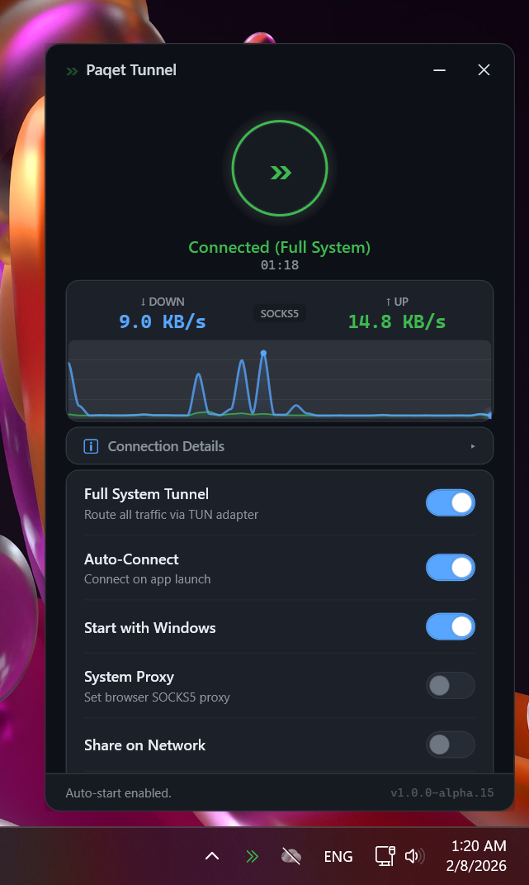

<div align="center">


# Paqet Tunnel

**Encrypted KCP tunnel with a modern Windows GUI**

*One-click setup · Full system tunnel · Smart DNS · 10 themes · LAN sharing*

[](LICENSE)
[](https://dotnet.microsoft.com/)
[](#)



</div>

---

## ✨ Features

| Feature | Description |
|---------|-------------|
| 🔒 **Full System Tunnel** | Routes all traffic through a TUN virtual adapter using WinTun |
| 🌐 **SOCKS5 Proxy** | Lightweight browser-only mode on `127.0.0.1:10800` |
| ⚡ **KCP Protocol** | UDP-based encrypted transport — faster than TCP in lossy networks |
| 🎯 **Smart DNS** | 18 DNS providers with auto-benchmark to find the fastest one |
| 🛡️ **DNS Leak Prevention** | Forces DNS on all network adapters to prevent leaks |
| 📡 **LAN Sharing** | Share the tunnel with other devices on your local network (port 10801) |
| 🎨 **10 Themes** | Dark, Light, Nord, Sakura, Ocean, Sunset, Cyberpunk, Dracula, Monokai, Rose |
| 🔄 **Auto-Connect** | Automatically connect on app start |
| 🚀 **Start with Windows** | Launch at boot with optional pre-logon start |
| 📊 **Live Speed Monitor** | Real-time upload/download speed in system tray |
| 🔁 **Auto-Reconnect** | Automatically recovers from connection drops |
| 🩺 **Health Monitoring** | Periodic tunnel health checks with automatic recovery |
| 🖥️ **System Tray** | Minimal footprint, always accessible from taskbar |

## 🚀 Quick Start

### Windows Client (One-liner)

Open **PowerShell as Administrator** and run:

```powershell
irm https://raw.githubusercontent.com/mewoZa/PaqetTunnel/master/setup.ps1 -o $env:TEMP\pt.ps1; & $env:TEMP\pt.ps1
```

Or with server details for fully automatic setup:

```powershell
irm https://raw.githubusercontent.com/mewoZa/PaqetTunnel/master/setup.ps1 -o $env:TEMP\pt.ps1; & $env:TEMP\pt.ps1 install -Addr YOUR_SERVER:8443 -Key "YOUR_KEY" -y
```

### Linux Server

```bash
curl -fsSL https://raw.githubusercontent.com/mewoZa/PaqetTunnel/master/setup.sh | sudo bash -s install
```

With a custom key:

```bash
curl -fsSL https://raw.githubusercontent.com/mewoZa/PaqetTunnel/master/setup.sh | sudo bash -s install --key "YOUR_KEY" --yes
```

> After server install, it prints the exact Windows one-liner with your server's IP and key — just copy and paste.

## 🏗️ Architecture

```
┌──────────────────────────────────────────────────────────────────┐
│  Windows Client                                                  │
│                                                                  │
│  ┌─────────────┐   ┌────────────┐   ┌──────────┐               │
│  │ PaqetTunnel │──▶│ tun2socks  │──▶│  paqet   │─── KCP/UDP ──┐│
│  │  WPF GUI    │   │ TUN→SOCKS5 │   │ SOCKS5   │  encrypted   ││
│  └─────────────┘   └────────────┘   │ :10800   │              ││
│        │                             └──────────┘              ││
│        ▼                                                       ││
│  ┌─────────────┐                                               ││
│  │   WinTun    │  Virtual network adapter                      ││
│  │  10.0.85.2  │  routes all system traffic                    ││
│  └─────────────┘                                               ││
└────────────────────────────────────────────────────────────────┘│
                                                                  │
┌────────────────────────────────────────────────────────────────┐│
│  Linux Server (VPS)                                            ││
│                                                                ││
│  ┌──────────┐                                                  ││
│  │  paqet   │◀── KCP/UDP encrypted ────────────────────────────┘│
│  │  :8443   │──▶ Internet                                      │
│  └──────────┘                                                  │
│                                                                │
│  Raw pcap (gopacket) — bypasses OS routing table               │
│  iptables NOTRACK + RST DROP for stealth                       │
└────────────────────────────────────────────────────────────────┘
```

### How It Works

1. **Server** runs paqet with KCP encrypted transport on your VPS using raw pcap
2. **Client** connects via KCP and exposes a local SOCKS5 proxy on `127.0.0.1:10800`
3. **TUN mode** (optional) creates a virtual adapter that routes *all* system traffic through the tunnel
4. **DNS** is forced on all adapters to prevent leaks — with 18 providers to choose from
5. **LAN sharing** lets other devices on your network use the tunnel via port 10801

## 🎨 Themes

| Theme | Style | Vibe |
|-------|-------|------|
| 🌑 **Dark** | GitHub-inspired dark | Clean, professional |
| ☀️ **Light** | Bright, airy | Daytime comfort |
| ❄️ **Nord** | Arctic blue palette | Calm, focused |
| 🌸 **Sakura** | Cherry blossom pink | Soft, anime-inspired |
| 🌊 **Ocean** | Deep sea blue | Immersive, cool |
| 🌅 **Sunset** | Warm amber glow | Cozy, evening |
| 🔮 **Cyberpunk** | Neon pink/purple | Sci-fi, electric |
| 🧛 **Dracula** | Classic dev purple | Iconic, easy on eyes |
| 🖥️ **Monokai** | Retro dev green | Nostalgic, hacker |
| 🌹 **Rose** | Elegant rosé | Refined, soft |

Switch themes instantly from Settings — no restart needed.

## 🧬 DNS Providers

Built-in smart DNS with auto-benchmark to find the fastest provider:

| Provider | Primary | Secondary |
|----------|---------|-----------|
| Cloudflare | `1.1.1.1` | `1.0.0.1` |
| Cloudflare Malware | `1.1.1.2` | `1.0.0.2` |
| Cloudflare Family | `1.1.1.3` | `1.0.0.3` |
| Google | `8.8.8.8` | `8.8.4.4` |
| Quad9 | `9.9.9.9` | `149.112.112.112` |
| OpenDNS | `208.67.222.222` | `208.67.220.220` |
| AdGuard | `94.140.14.14` | `94.140.15.15` |
| AdGuard Family | `94.140.14.15` | `94.140.15.16` |
| NextDNS | `45.90.28.167` | `45.90.30.167` |
| CleanBrowsing Security | `185.228.168.9` | `185.228.169.9` |
| CleanBrowsing Family | `185.228.168.168` | `185.228.169.168` |
| DNS.SB | `185.222.222.222` | `45.11.45.11` |
| Comodo Secure | `8.26.56.26` | `8.20.247.20` |
| Verisign | `64.6.64.6` | `64.6.65.6` |
| Control D | `76.76.2.0` | `76.76.10.0` |
| Mullvad | `194.242.2.2` | `194.242.2.3` |

Use **Auto** mode to benchmark all providers and select the fastest, or pick your favorite manually.

## 📋 CLI Commands

Both setup scripts (`setup.ps1` for Windows, `setup.sh` for Linux) support:

### Commands

| Command | Description |
|---------|-------------|
| `install` | Full installation with configuration |
| `update` | Update paqet binary and app to latest version |
| `uninstall` | Complete removal of all components |
| `status` | Show current service/process status |
| `help` | Display all available options |

### Flags

| Windows (`setup.ps1`) | Linux (`setup.sh`) | Description |
|------------------------|---------------------|-------------|
| `-Addr ip:port` | `--addr ip:port` | Server address |
| `-Key "secret"` | `--key "secret"` | Pre-shared encryption key |
| `-Iface name` | `--iface name` | Network interface override |
| `-SocksPort 10800` | — | SOCKS5 listen port |
| `-Build` | `--build` | Build from source (requires Go + CGO) |
| `-Force` | — | Force reinstall |
| `-y` | `--yes` | Skip all confirmations |

## 🛠️ Building from Source

### Requirements

- [.NET 8 SDK](https://dotnet.microsoft.com/download/dotnet/8.0) (Windows)
- [Go 1.21+](https://go.dev/dl/) with CGO enabled (for building paqet from source)
- Linux server: `build-essential`, `libpcap-dev`

### Build the GUI

```powershell
dotnet publish src/PaqetTunnel/PaqetTunnel.csproj -c Release -r win-x64 --self-contained -p:PublishSingleFile=true -p:IncludeNativeLibrariesForSelfExtract=true
```

### Build paqet from source

```bash
# Linux
CGO_ENABLED=1 go build -o paqet ./cmd/main.go

# Windows (requires MinGW + Npcap)
set CGO_ENABLED=1
go build -o paqet.exe ./cmd/main.go
```

## 📁 Project Structure

```
PaqetTunnel/
├── src/PaqetTunnel/          # WPF application (.NET 8)
│   ├── Views/                # XAML views
│   ├── ViewModels/           # MVVM view models
│   ├── Services/             # Core services
│   │   ├── PaqetService.cs   # Paqet process management
│   │   ├── TunService.cs     # TUN adapter & routing
│   │   ├── DnsService.cs     # DNS management & benchmark
│   │   ├── ProxyService.cs   # System proxy & LAN sharing
│   │   ├── ThemeManager.cs   # Runtime theme switching
│   │   └── ...
│   ├── Themes/               # 10 theme ResourceDictionaries
│   └── Models/               # Data models & config
├── setup.sh                  # Linux server installer
├── setup.ps1                 # Windows client installer
├── paqet/                    # Paqet submodule (Go)
└── installer/                # InnoSetup scripts
```

## 🔒 Security

- **KCP encryption** with pre-shared key for all tunnel traffic
- **Raw pcap** transport — paqet sends/receives directly on the NIC, bypassing OS routing
- **iptables NOTRACK** on server prevents connection tracking overhead
- **RST DROP** makes the server invisible to port scans
- **DNS leak prevention** forces DNS on all adapters
- **No server bypass route** — paqet's raw pcap eliminates circular routing concerns

## 📝 Notes

- Windows Defender may flag paqet as a false positive — this is common for tunneling tools. The installer automatically adds exclusions.
- The TUN adapter uses IP `10.0.85.2` with gateway `10.0.85.1`.
- SOCKS5 port is `10800` (not 1080, to avoid Windows ICS conflicts).
- LAN sharing port is `10801`.

## 🙏 Credits

- [paqet](https://github.com/hanselime/paqet) by hanselime — KCP tunnel engine
- [tun2socks](https://github.com/xjasonlyu/tun2socks) by xjasonlyu — TUN-to-SOCKS5 adapter
- [WinTun](https://www.wintun.net/) by WireGuard — Windows TUN driver

## 📄 License

[MIT](LICENSE)
